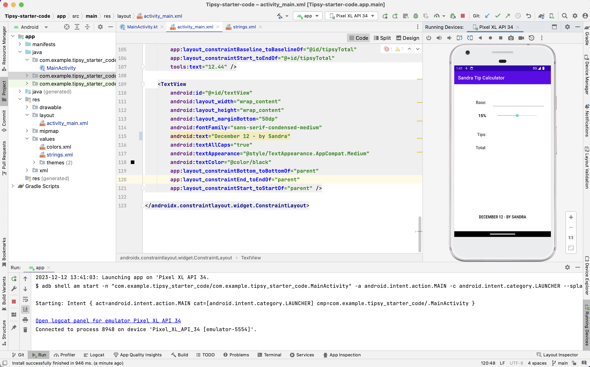
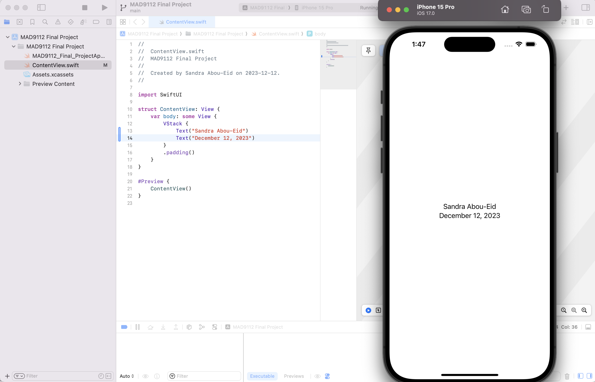
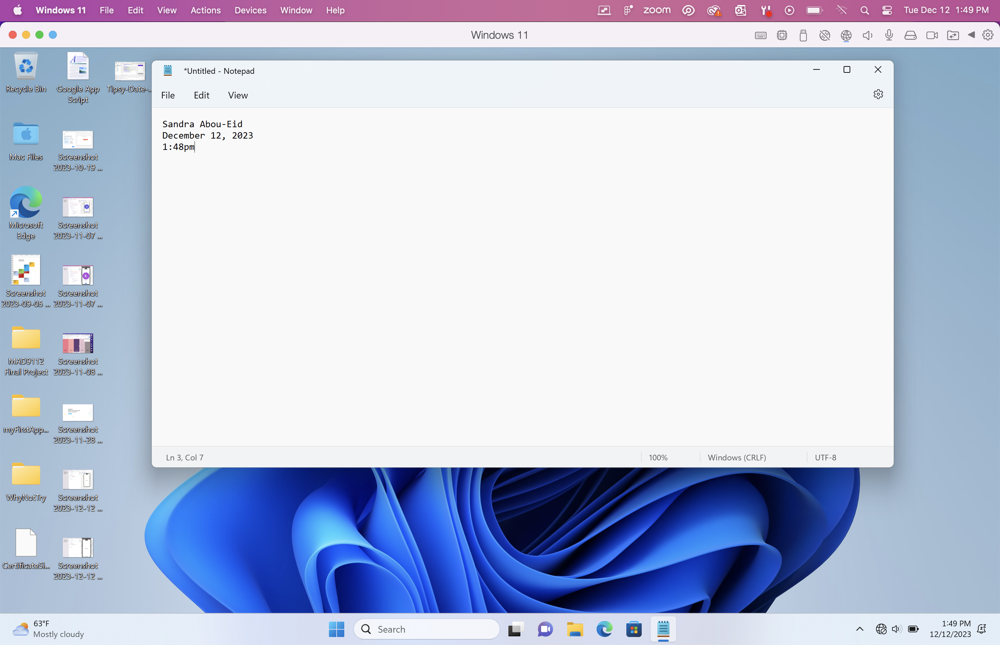

# Sandra_Abou-Eid_FinalProject

```
function getDaysUntilChristmas() {
    let today = new Date();
    let christmas = new Date(today.getFullYear(), 11, 25)
    let msDay = 60 * 60 * 24 * 1000 //milliseconds in a day
    let daysUntilChristmas = Math.ceil((christmas - today) / msDay)
    console.log(daysUntilChristmas)
}

getDaysUntilChristmas()
```


Android Screenshot



iOS Screenshot



Parallels Screenshot
